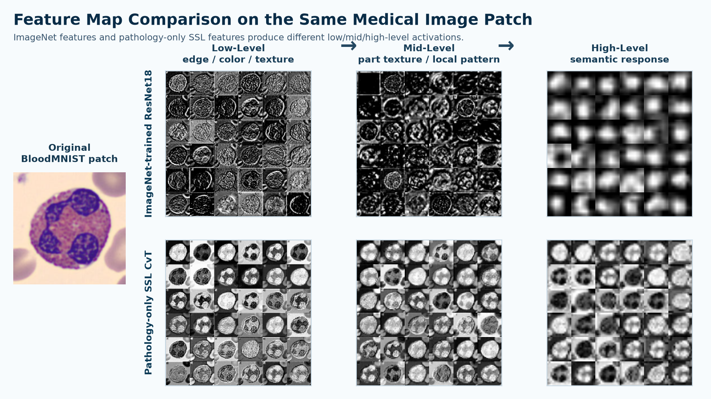
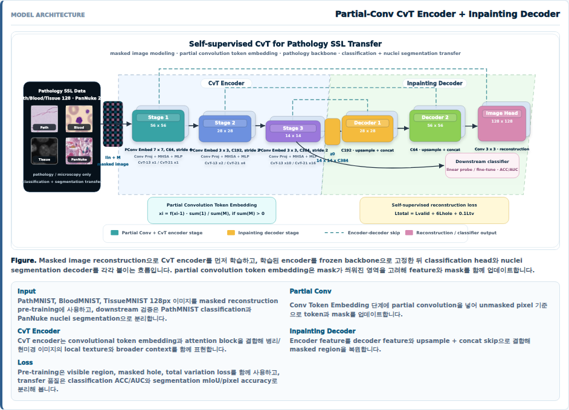
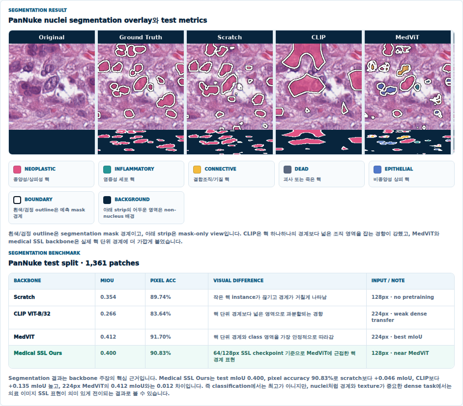
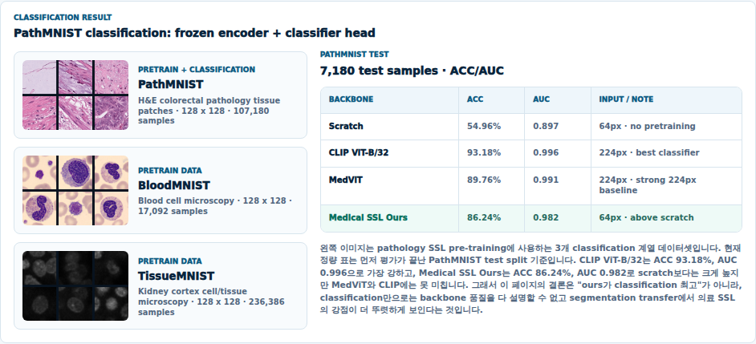

# Pathology SSL Backbone

병리/현미경 이미지를 위한 self-supervised representation learning 프로젝트입니다. 단일 classification 성능만 보는 대신, 같은 frozen encoder를 classification과 nuclei segmentation에 각각 연결해 의료 이미지 표현이 downstream task로 얼마나 전이되는지 검증했습니다.

<p align="center">
  
</p>

## Why This Project Matters

이 프로젝트는 ImageNet으로 사전학습한 backbone을 병리 이미지에 그대로 적용해도 충분한가라는 질문에서 출발했습니다. 병리/현미경 이미지는 일반 사진처럼 사물의 윤곽과 배경을 구분하는 문제가 아니라, 세포핵의 모양과 밀도, 염색 농도, 조직 texture, 미세한 경계처럼 전문적인 시각 단서를 읽어야 합니다. 그런데 이런 단서를 supervised 방식으로 학습하려면 전문 annotation이 필요하고, 의료 데이터에서는 label 확보 비용이 높아 충분한 규모의 정답 데이터를 만들기 어렵습니다.

그래서 병리 이미지 자체에서 label 없이 표현을 먼저 학습하는 self-supervised learning이 필요했습니다. 이 프로젝트에서는 PathMNIST, BloodMNIST, TissueMNIST, PanNuke 데이터를 사용해 Partial-Convolution CvT encoder를 masked reconstruction 방식으로 먼저 학습하고, 학습된 backbone이 classification과 segmentation으로 실제 전이되는지 확인했습니다.

상단 이미지는 같은 BloodMNIST patch를 ImageNet-pretrained ResNet18과 pathology-only SSL CvT encoder에 넣고, low/mid/high-level feature map을 channel grid로 비교한 결과입니다.

이 이미지는 "어느 쪽 feature map이 더 선명한가"를 비교하는 그림이 아닙니다. ImageNet row가 더 또렷해 보일 수 있는데, 이는 자연 이미지에서 학습한 edge, color contrast, object texture prior가 BloodMNIST의 세포 경계에도 강하게 반응하기 때문입니다. 읽어야 하는 지점은 pathology-only SSL row에서 세포 단위 형태와 핵 내부 패턴이 여러 channel에 반복적으로 나타난다는 점입니다.

- **ImageNet feature**는 세포 외곽선과 대비에 강하게 반응하지만, 이것이 병리적으로 중요한 핵 내부 구조를 안정적으로 이해한다는 뜻은 아닙니다.
- **Pathology SSL feature**는 여러 channel에서 세포 단위 형태와 핵 내부 패턴이 반복적으로 나타납니다. 이는 모델이 자연 이미지 사물 prior가 아니라 microscopy/pathology patch 자체에서 representation을 학습했다는 신호입니다.
- 따라서 이 그림은 "Pathology SSL이 시각적으로 더 예쁘다"가 아니라, 병리 이미지에는 병리 이미지로 학습한 domain-specific feature prior가 필요하다는 연구 배경을 보여주기 위한 자료입니다.

제가 이 프로젝트에서 보여주고 싶은 역량은 세 가지입니다.

- 의료 이미지 특성에 맞춰 pretext task와 downstream evaluation을 분리해 설계하는 능력
- PyTorch 기반 데이터 파이프라인, 학습 루프, checkpoint, TensorBoard logging을 직접 구성하는 ML engineering 역량
- classification 결과만으로 모델을 과장하지 않고, segmentation transfer까지 함께 해석하는 실험적 판단력

## Project Snapshot

| Area | Detail |
| --- | --- |
| Task | Pathology SSL pre-training, PathMNIST classification, PanNuke nuclei segmentation |
| Backbone | Partial-Convolution CvT encoder |
| Pretext task | Masked image reconstruction |
| Transfer setup | Frozen encoder + classifier head / lightweight segmentation decoder |
| Main stack | Python, PyTorch, TorchVision, TensorBoard, NumPy, PyArrow, Pillow |
| Portfolio page | React page captured from `/projects/medical-ai/medical-classification` |

## Model Design



The core model is a CvT-style encoder with partial convolution token embedding. During pre-training, masked pathology images are reconstructed through an inpainting decoder. After pre-training, the encoder is reused as a frozen medical image backbone and evaluated with two different heads.

- **Partial Convolution Token Embedding**: mask-aware token extraction for pathology image patches
- **CvT Encoder**: convolutional token embedding plus attention blocks for local texture and broader context
- **Inpainting Decoder**: reconstructs masked regions through upsampling and skip-style feature reuse
- **Transfer Heads**: classifier head for PathMNIST and segmentation decoder for PanNuke

## Evaluation Strategy

이 프로젝트의 핵심은 "classification에서 최고인가?"가 아니라 "의료 이미지 표현이 다른 task로도 전이되는가?"입니다. 그래서 classification과 segmentation을 나눠 평가했습니다.

### PanNuke Segmentation Transfer



| Backbone | mIoU | Pixel Acc | Note |
| --- | ---: | ---: | --- |
| Scratch | 0.354 | 89.74% | no pretraining |
| CLIP ViT-B/32 | 0.266 | 83.64% | weak dense transfer |
| MedViT | 0.412 | 91.70% | best mIoU |
| Medical SSL Ours | 0.400 | 90.83% | near MedViT |

Medical SSL backbone은 PanNuke test 기준 mIoU 0.400, pixel accuracy 90.83%를 기록했습니다. scratch 대비 +0.046 mIoU, CLIP 대비 +0.135 mIoU 높고, MedViT의 0.412 mIoU와는 0.012 차이입니다.

이 결과는 nuclei처럼 경계와 texture가 중요한 dense task에서 의료 이미지 기반 SSL 표현이 의미 있게 전이된다는 근거입니다.

### PathMNIST Classification Transfer



| Backbone | ACC | AUC | Note |
| --- | ---: | ---: | --- |
| Scratch | 54.96% | 0.897 | no pretraining |
| CLIP ViT-B/32 | 93.18% | 0.996 | best classifier |
| MedViT | 89.76% | 0.991 | strong 224px baseline |
| Medical SSL Ours | 86.24% | 0.982 | above scratch |

Classification에서는 CLIP과 MedViT가 더 강합니다. 하지만 Medical SSL Ours는 scratch 대비 큰 폭으로 개선됐고, segmentation transfer에서는 MedViT에 가까운 결과를 보였습니다. 이 차이를 그대로 드러내는 것이 이 프로젝트의 포인트입니다.

## What I Built

- `datasets.py`: MedMNIST `.npz`, PanNuke parquet 데이터를 읽고 image/mask tensor로 변환하는 dataset pipeline
- `models.py`: Partial-Conv CvT encoder, SSL reconstruction model, classification model, segmentation model
- `losses.py`: masked reconstruction loss와 segmentation loss
- `metrics.py`: classification accuracy, segmentation mIoU, pixel accuracy
- `train_ssl.py`: masked reconstruction 기반 self-supervised pre-training loop
- `train_classification.py`: frozen/fine-tuned encoder classification transfer loop
- `train_segmentation.py`: PanNuke nuclei segmentation transfer loop
- `train.sh`: venv 생성, dependency 설치, 학습 entrypoint를 묶은 실행 스크립트

## Repository Layout

```text
pathology_ssl/
├── README.md
├── assets/
│   ├── imagenet-vs-pathology-feature-map-grid.png
│   ├── pathology-ssl-architecture.png
│   ├── pathology-ssl-segmentation-transfer.png
│   └── pathology-ssl-classification-benchmark.png
├── config.py
├── datasets.py
├── losses.py
├── masking.py
├── metrics.py
├── models.py
├── train.sh
├── train_ssl.py
├── train_classification.py
├── train_segmentation.py
└── utils.py
```

`data/`, `checkpoints/`, `runs/`, `logs/`는 로컬 학습 산출물이므로 Git에서 제외합니다. 정리된 benchmark CSV만 `outputs/benchmark/`에 보존합니다.

## Run

```bash
./train.sh setup
```

Self-supervised pre-training:

```bash
./train.sh ssl --amp
```

Classification transfer:

```bash
./train.sh classification --source pathmnist_128 --freeze-encoder
```

Segmentation transfer:

```bash
./train.sh segmentation --batch-size 4
```

CUDA용 PyTorch wheel이 필요하면 `TORCH_INDEX_URL`을 지정할 수 있습니다.

```bash
TORCH_INDEX_URL=https://download.pytorch.org/whl/cu121 ./train.sh setup
```

## Portfolio Takeaway

이 프로젝트는 "모델 하나를 학습했다"보다 조금 더 넓은 문제를 보여주기 위해 만들었습니다. 의료 이미지에서는 classification 성능만으로 backbone 품질을 설명하기 어렵습니다. 그래서 masked reconstruction pre-training, frozen transfer, classification/segmentation 이중 평가, 시각적 결과 비교까지 하나의 흐름으로 묶었습니다.

저는 이 프로젝트를 통해 모델링뿐 아니라 데이터 처리, 학습 자동화, 실험 해석, 포트폴리오 화면 구성까지 end-to-end로 다룰 수 있다는 점을 보여주고 싶었습니다.
